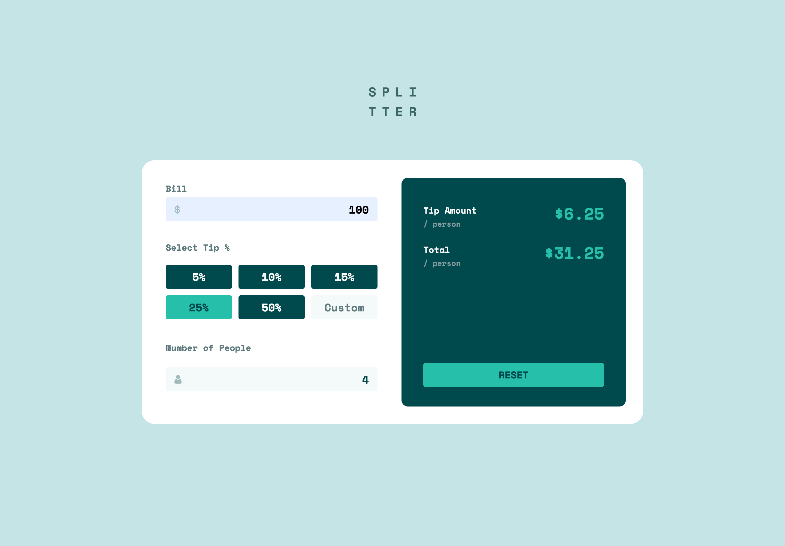

# Frontend Mentor - Tip calculator app solution

This is a solution to the [Tip calculator app challenge on Frontend Mentor](https://www.frontendmentor.io/challenges/tip-calculator-app-ugJNGbJUX). Frontend Mentor challenges help you improve your coding skills by building realistic projects.

## Table of contents

- [Overview](#overview)
  - [The challenge](#the-challenge)
  - [Screenshot](#screenshot)
  - [Links](#links)
- [My process](#my-process)
  - [Built with](#built-with)
  - [What I learned](#what-i-learned)
  - [Continued development](#continued-development)
  - [Useful resources](#useful-resources)
- [Author](#author)
- [Acknowledgments](#acknowledgments)

## Overview

### The challenge

Users should be able to:

- View the optimal layout for the app depending on their device's screen size
- See hover states for all interactive elements on the page
- Calculate the correct tip and total cost of the bill per person

### Screenshots

#### Desktop

#### Mobile

### Links

- Solution URL: [https://github.com/bnielsencodes/Splitter](https://github.com/bnielsencodes/Splitter)
- Live Site URL: [https://bnielsen.dev/Splitter](https://bnielsen.dev/Splitter)

## My process

### Built with

- HTML5 markup
- Tailwind CSS
- Flexbox
- CSS Grid
- Mobile-first workflow

### Continued development

I really wanted to use React with this project, but am not comfortable enough with it yet so I stuck to HTML, Tailwind CSS, and vanilla JavaScript. I plan on continuing to improve my React skills and knowledge so I can feel more confident to use it on future projects.

## Author

- Website - [Brandon Nielsen](https://www.bnielsen.dev)
- Frontend Mentor - [@bnielsencodes](https://www.frontendmentor.io/profile/bnielsencodes)
- Twitter - [@bnielsencodes](https://twitter.com/bnielsencodes)
